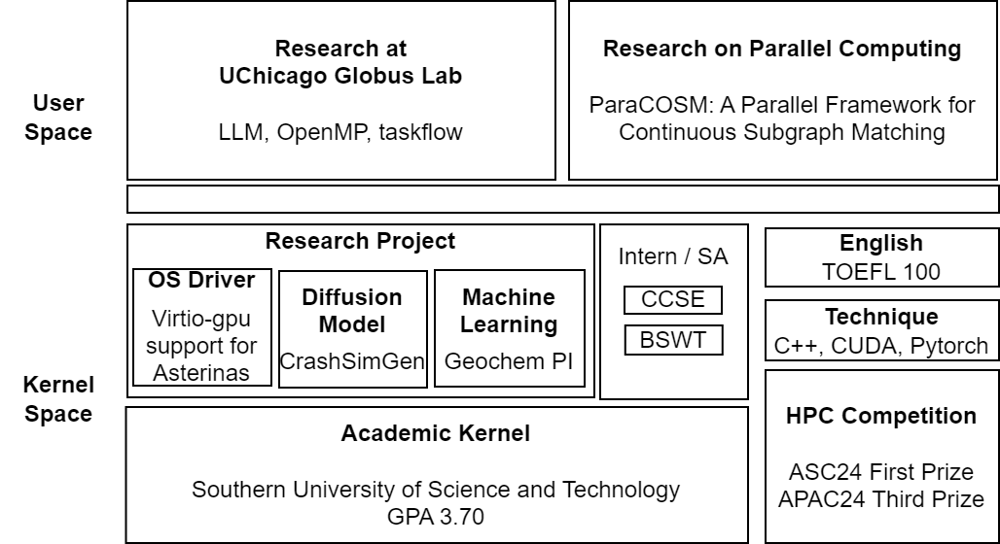
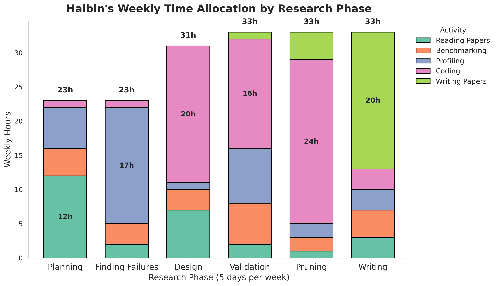
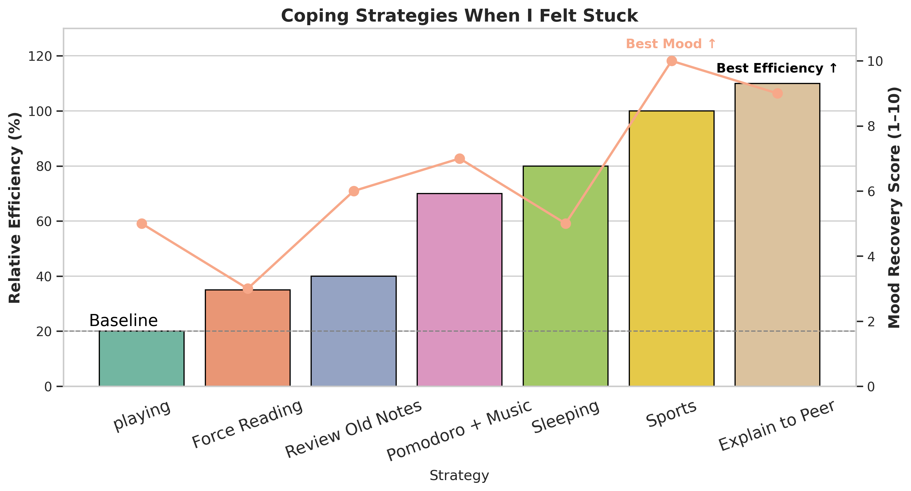

<!-- ---
permalink: /
title: "Haibin's Page"
excerpt: ""
author_profile: true
redirect_from: 
  - /index23423423/
  # - /index.html
--- -->








<span class='anchor' id='about-me'></span>


<div style="position: relative;">
  
</div>


<div style="font-family: Times, 'Times New Roman', serif; font-size: 17pt; font-weight: bold; text-align: center;">
  Haibin: A High Performance System Researcher
</div>

<!-- # Haibin: A High Performance System Researcher -->

# Abstract

<!-- I am a Junior Turing Class student at SUSTech, majoring in Computer Science. Problem-solving is my lifelong delight. I am currently participating in research in the fields of Distributed Computing, GPU Computing, and High Performance Computing at the SUSTech HPC-Lab.  -->

We present Haibin, a  system researcher dedicated in **High Performance Computing(HPC)**. Haibin is a Junior Turing Class student at **Southern University of Science and Technology** (SUSTech), majoring in **Computer Science**. Problem-solving is his lifelong delight. He is currently participating in research in the fields of Parallel Computing, GPU Computing, and Distributed Computing at the SUSTech HPC-Lab. 


<!-- 正文 -->
<!-- <div style="font-family: Times, 'Times New Roman', 'Libre Baskerville', serif; font-size: 13pt; text-align: justify; line-height: 1.2; margin-bottom: 20px;">
  We present Haibin, a system researcher dedicated to <strong>High Performance Computing (HPC)</strong>. Haibin is a Junior Turing Class student at <strong>Southern University of Science and Technology (SUSTech)</strong>, majoring in <strong>Computer Science</strong>. Problem-solving is his lifelong delight. He is currently participating in research in the fields of Parallel Computing, GPU Computing, and Distributed Computing at the SUSTech HPC-Lab.
</div> -->

<!-- I have published 0 papers in system area. <a href='https://scholar.google.com/citations?user=DhtAFkwAAAAJ'>google scholar citations <strong><span id='total_cit'>260000+</span></strong></a> (You can also use google scholar badge <a href='https://scholar.google.com/citations?user=DhtAFkwAAAAJ'></a>). -->


## Keywords

 High Performance Computing, Operating System, Software Engineering, Compiler

<!-- # Area

High Performance Computing (HPC) -->

# Introduction

- What would happen if you use `gdb` to observe another `gdb`?

- How did LLVM implement `OpenMP`?

- In context switches, we have `PCB`. So why do we still need to store information in the user stack and kernel stack?

My research motivation stems from a deep curiosity for these "**stupid**" problems.  I find profound joy in discovering and dissecting the hidden mechanisms behind computer systems.


**"Live, travel, adventure, bless, and don’t be worry."**


<div class='paper-box'><div class='paper-box-image'><div><div class="badge">ICPP 2025</div></div></div>
<div class='paper-box-text' markdown="1">

<!-- [ParaCOSM: A Parallel Framework for Continuous Subgraph Matching](https://openaccess.thecvf.com/content_cvpr_2016/papers/He_Deep_Residual_Learning_CVPR_2016_paper.pdf) -->
ParaCOSM: A Parallel Framework for Continuous Subgraph Matching

**Haibin Lai**, Sicheng Zhou, Site Fan, Zhuozhao Li

[**Paper**](https://haibinlai.github.io/File.github.io/icpp25-5.pdf) <strong><span class='show_paper_citations' data='DhtAFkwAAAAJ:ALROH1vI_8AC'></span></strong>
- In this paper, we present ParaCOSM (**Para**llel 
**CO**ntinuous  **S**ubgraph **M**atching), an efficient parallel framework for existing **Continuous Subgraph Matching** algorithms on CPU. 
ParaCOSM achieves $1.2\times$ to $30.2\times$ speedups across datasets and up to two orders of magnitude faster execution, with up to 71% higher success rates on large query graph . 

- [ParaCOSM github repo](https://github.com/SUSTech-HPCLab/ParaCOSM)
</div>
</div>


<!-- 在下面加入一张图片 -->
<!--  -->
<!-- 
 -->

<!--  -->


  <!-- ```python
     pipe = pipeline(
        "text-generation", 
        model=model_id, 
        torch_dtype=torch.bfloat16, 
        device_map="auto",
        max_new_tokens=128,
    )
  ``` -->


<!-- # 🔥 News
- *2022.02*: &nbsp;🎉🎉 Lorem ipsum dolor sit amet, consectetur adipiscing elit. Vivamus ornare aliquet ipsum, ac tempus justo dapibus sit amet. 
- *2022.02*: &nbsp;🎉🎉 Lorem ipsum dolor sit amet, consectetur adipiscing elit. Vivamus ornare aliquet ipsum, ac tempus justo dapibus sit amet.  -->


# Haibin's Main Design


As shown in Figure 2, my academic architecture integrates two research applications and multiple project-level modules. In this architecture, I am fueled by a principle I live and work by:

"The only people for me are the mad ones, the ones who are mad to live, mad to talk, mad to be saved, desirous of everything at the same time, the ones who never yawn or say a commonplace thing, but burn, burn, burn like fabulous yellow roman candles exploding like spiders across the stars and in the middle you see the blue centerlight pop and everybody goes ‘Awww!"

— Jack Kerouac

<div style="text-align: center;">
  
  <div style="font-family: Times, 'Times New Roman', serif; font-size: 10pt; font-style: italic; margin-top: 5px;">
    Figure 2: Haibin's Main Architecture.
  </div>
</div>

<div style="text-align: center;">
  
  <div style="font-family: Times, 'Times New Roman', serif; font-size: 10pt; font-style: italic; margin-top: 5px;">
    Figure 1: Haibin's HPC academic architecture.
  </div>
</div>


# Education

Sept 2022 – Present, **Southern University of Science and Technology, Undergraduate in Computer Science**

- GPA: 3.70/4.0

- Coursework: **Operating System(H)** 96, **Machine Learning(H)** 96


#  Publications 
<!-- 📝 -->


# Research Project 


- *Aug 2024 - Mar 2025*, [Geochemistrypi](https://github.com/ZJUEarthData/Geochemistrypi), China.
Online Intern, Zhejiang University DataEarth Lab. 

- *Dec 2024 - Jan 2025*, [Viritio-gpu support for Asterinas OS](https://github.com/HaibinLai/HaibinLai.github.io/blob/main/docs/Asterinas_Virtio_GPU_Driver.pdf).  Implemented virtio-gpu driver in Asterinas Operating System on Qemu using **Rust**. The driver works with page buffer scheme and allow user library like mesa communicates with qemu virtio using specfic syscall.

<!-- <div class='paper-box'><div class='paper-box-image'><div><div class="badge">First Prize of CS329 Machine Learning(H)</div></div></div>
<div class='paper-box-text' markdown="1"> -->

- *Nov 2024 - Jan 2025*, [CrashSimGen: Generating Safety-Critical Scenarios with Diffusion Models](https://github.com/HaibinLai/CrashSimGen).  CrashSimGen is a project that generates dangerous road scenarios using diffusion models for autonomous driving risk assessment. Tools Used: Pytorch, Tensorflow.


# Internships

- March 2025 - Present: **Visiting Student**,
UChicago Globus Lab. Research on High Performance Implementation of OpenMP for many socket machines. 


- Feb 2024 – Aug 2024: 
**Student Assistant**, SUSTech Center for Computational Science and Engineering. Participated in the operation and maintenance of SUSTech **Qiming** and **Taiyi** Supercomputer.

- Aug 2023 - Sep 2023: **Intern** , Beijing Sunway World Technology Co., Ltd.

# HPC Awards
- *Dec 2024*: **7th APAC HPC-AI Student Competition** ; **Third Prize** ; Leader of HPC Team, using HPC-X communication library to accerlerate Hoomd-blue HPC software;
- *Apr 2024*: **ASC Student Supercomputer Challenge**; **First Prize** ; LINPACK benchmark and parallel optimization of materials science calculations


<!-- # Educations
Sept 2022 – Present, **Southern University of Science and Technology, Undergraduate in Computer Science**

- GPA: 3.70/4.0

- Coursework: **Operating System(H)** 96, **Machine Learning(H)** 96 -->


<!-- , Computer Organization(H), Computer Network 89 -->
<!-- - *2015.09 - 2019.06*, Lorem ipsum dolor sit amet, consectetur adipiscing elit. Vivamus ornare aliquet ipsum, ac tempus justo dapibus sit amet.  -->

---

# Related Works

### Honors

- *Nov 2024*, 2024 Outstanding Student Award
- *Jan 2024*, Contemporary Undergraduate Mathematical Contest in Modeling (CUMCM) 
- *Nov 2023*, 2023 Outstanding Student Award
- *Sep 2022*, 2022 President's Special Scholarship

### English Skills
- *Oct 2024*, **TOEFL**. Score: 100/120; speaking 22, listening 26, reading 30, writing 22
- *Jun 2024*, **CET6**: 649/710
- *Jun 2023*, **CET4**: 604/710
- *Jul 2023*, **Georgia Institute of Technology ASP Program**
 .  Participated in summer courses at Georgia Tech, enhancing international communication skills and gaining insights into American culture.

### Techniques

**Languages**: C++, C, CUDA, Java, python, Rust, SQL

PostgreSQL, Docker, Linux


# Experiment

## Time Distribution

To understand how time is distributed throughout a research lifecycle, Haibin categorizes research into **six key stages**:

> **Planning** (2 months), **Finding Failures** (1 month), **Main Design** (2 months), **Validation** (3 months), **Pruning and Boosting** (2 months), and **Writing Papers** (1 month).

For each stage, two representative weeks were randomly sampled, and detailed work activity logs were extracted from [Toggl Track](https://toggl.com/) as figure 3 shows. Class homework and unrelated tasks were excluded.

<!-- <div style="position: relative;">
  
</div> -->


<div style="text-align: center;">
  
  <div style="font-family: Times, 'Times New Roman', serif; font-size: 10pt; font-style: italic; margin-top: 5px;">
    Figure 3: Haibin's Working Status
  </div>
</div>

Haibin’s research process shows clear **stage separation** and **role reallocation**: early stages are exploration-heavy (reading, benchmarking), middle stages are dominated by **implementation and validation**, and final stages shift toward **refinement and storytelling**.

## Working Efficiency

To better understand when Haibin achieves peak productivity, we conducted a self-tracking experiment across several real-world conditions. The measured efficiency is normalized to solo coding (100%) as baseline. The results are shown in Figure 4.

<div style="text-align: center;">
  
  <div style="font-family: Times, 'Times New Roman', serif; font-size: 10pt; font-style: italic; margin-top: 5px;">
    Figure 4: Haibin's Working Efficiency
  </div>
</div>

Haibin's peak productivity occurred "3 hours before deadline" with a 300% efficiency boost. Also, the Pomodoro technique resulted in 150% efficiency. And  Classical Music yielded 145% efficiency for coding and experimenting.


## Coping Resilience Strategies

As shown in Figure 5, I tracked the relative efficiency (compared to baseline solo coding) and mood recovery (self-rated on a 1–10 scale) for each method.

<div style="text-align: center;">
  
  <div style="font-family: Times, 'Times New Roman', serif; font-size: 10pt; font-style: italic; margin-top: 5px;">
    Figure 5: Haibin's Coping Resilience Strategies Comparsion
  </div>
</div>

Simple techniques such as sports and structured rest (e.g., Pomodoro + music) proved helpful, with explaining ideas to a peer emerging as the most effective strategy—boosting productivity to 110% and offering high emotional relief.

This experiment helped me realize that productivity is not just about time, but also mindset, environment, and support. Apparently, talking to people > talking to myself.


# Contact

Although Haibin is not open-sourced with Apache Licence 2.0, you can reach him at 12211612@mail.sustech.edu.cn .


<!-- # Achknowledgement

We acknowledge the helpful support and guidance from professor **Zhuozhao Li**, **Kyle Chard** and **Ian Foster**. Special Thanks to Sicheng Zhou, Bowen Zhang, Yicheng Xiao, Zudong Li, Yukun Yang, Jiahua Zhao, Prof. Shiqi Yu, Prof. Yinqian Zhang. This research is supported by my mom and my dad. -->

 <!-- <embed src="https://github.com/HaibinLai/HaibinLai.github.io/blob/main/docs/Asterinas_Virtio_GPU_Driver.pdf" width="800px" height="600px" /> -->


<!-- <iframe src="https://docs.google.com/viewer?url=https://github.com/HaibinLai/HaibinLai.github.io/blob/main/docs/Asterinas_Virtio_GPU_Driver.pdf&embedded=true" style="width:100%; height:600px;" frameborder="0"></iframe> -->


 <!-- [点击这里查看PDF文件](https://github.com/HaibinLai/HaibinLai.github.io/blob/main/docs/Asterinas_Virtio_GPU_Driver.pdf) -->


<!-- <script src="https://mozilla.github.io/pdf.js/build/pdf.js"></script> -->

<!-- <div style="width: 100%; height: 600px;">
<canvas id="pdf-canvas" style="border: 1px solid;"></canvas>
</div> -->

<!-- <iframe src="https://github.com/HaibinLai/HaibinLai.github.io/blob/main/docs/Asterinas_Virtio_GPU_Driver.pdf" width="640" height="480"></iframe> -->

<!-- <iframe src="https://github.com/HaibinLai/HaibinLai.github.io/blob/main/docs/Asterinas_Virtio_GPU_Driver.pdf&embedded=true" style="width:500px; height:100px;" frameborder="0"></iframe>
  -->
<!-- <iframe src="https://github.com/HaibinLai/HaibinLai.github.io/blob/main/docs/Asterinas_Virtio_GPU_Driver.pdf" style="width:600px; height:500px;" frameborder="0"></iframe> -->

<!-- <script src="/js/pdfobject.js"></script>
<script>PDFObject.embed("https://www.haibinlaiblog.top/wp-content/uploads/2025/01/ML_Essay_Haibin_Lai-13.pdf", "#example1");</script> -->


<!-- <iframe src="https://www.haibinlaiblog.top/wp-content/uploads/2025/01/ML_Essay_Haibin_Lai-13.pdf" style="width:500px; height:600px;" frameborder="0"></iframe> -->

<!-- <iframe src="https://github.com/HaibinLai/HaibinLai.github.io/blob/main/docs/Asterinas_Virtio_GPU_Driver.pdf" width="100%" height="600px" style="border: none;">
This browser does not support PDFs
</iframe> -->

<!-- <center><embed src="https://github.com/HaibinLai/HaibinLai.github.io/blob/main/docs/Asterinas_Virtio_GPU_Driver.pdf" width="850" height="600"></center>
 

<script>
var url = 'https://github.com/HaibinLai/HaibinLai.github.io/blob/main/docs/Asterinas_Virtio_GPU_Driver.pdf';

// 使用pdf.js渲染和显示PDF
pdfjsLib.getDocument(url).promise.then(function(pdfDoc) {
 var canvas = document.getElementById('pdf-canvas');
 var context = canvas.getContext('2d');

 // 获取PDF的第一页
 pdfDoc.getPage(1).then(function(page) {
   var viewport = page.getViewport({scale: 1});
   canvas.height = viewport.height;
   canvas.width = viewport.width;

   // 渲染PDF页面到canvas
   page.render({canvasContext: context, viewport: viewport});
 });
});
</script> -->


<!-- # 💻 Internships

- March 2025 - Present: **Visiting Student**,
UChicago Globus Lab. Research on High Performance Implementation of OpenMP for many socket machines. [Related Paper](https://arxiv.org/abs/2502.05293)


- Feb 2024 – Aug 2024: 
**Student Assistant**, SUSTech Center for Computational Science and Engineering. Participated in the operation and maintenance of SUSTech **Qiming** and **Taiyi** Supercomputer.

- Aug 2023 - Sep 2023: **Intern** , Beijing Sunway World Technology Co., Ltd. -->


<!-- 

Main Structure

1. My intro (short)
  1.1 GPA 3.70
  1.2 Distributed System, HPC, OS
  1.3 Globus, HPC Lab, ZJU Data Earth
  1.4 C++, Rust, Python

2. pub
  2.1 Graph HPC
  2.2 Poster Hoomd-blue
  2.3 Distributed ?

3. intern
  - research
  3.1 Globus Lab
  3.2 SUSTech HPC Lab
  3.3 ZJU Data Earth
  - industry
  3.4 Sunway
  3.5 ??? Company

4. project
  4.1 OpenCV Project
  4.2 OS Project
  4.3 ML Project
  4.4 CPU Project
  4.5 DB Project

5. Award in HPC
  5.1 ASC Supercomputing
  5.2 APAC

6. Language
  6.1 TOEFL 100
  6.2 CET6 649
  6.3 CET4 604

7. Techniques
  - Programming skills
  C/C++, CUDA, Rust, python, verilog, java,
  - Tools
  Docker, Kubernetes, VMware, eNSP, gdb, 

  - books I have read
  <OSTEP>
  <Computer Arch>
  <A quantuantive approch>
  <>
8. My Research path (another page maybe?)

 -->